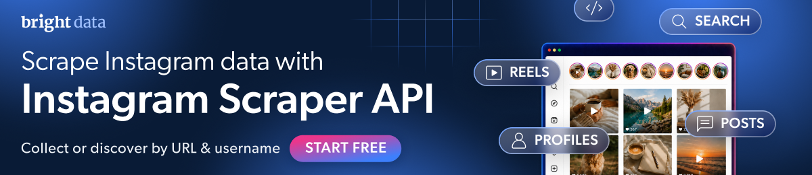

[](https://brightdata.com/products/web-scraper/instagram?utm_source=github)

# instagram-scraper-node

[](https://github.com/brightdata/instagram-scraper-node/actions/workflows/live.yml)
[](https://github.com/brightdata/instagram-scraper-node/actions/workflows/live.yml) <!-- verified: rewritten by the daily run -->

[Quickstart](#quickstart) · [Command](#or-run-it-as-a-command) · [Endpoints](#the-rest-of-the-api) · [Data](#the-data) · [Errors](#when-it-fails) · [Coding agents](#coding-agents) · [Docs](https://docs.brightdata.com/products/scrapers/instagram/introduction) · [Support](#support)

Instagram profiles, posts, reels and comments as JSON, in JavaScript. No
Instagram login, no browser. Built on the
[Bright Data Instagram Scraper API](https://brightdata.com/products/web-scraper/instagram?utm_source=github).

Uses the [Bright Data JavaScript SDK](https://github.com/brightdata/sdk-js).
Full API docs:
[Instagram Scraper API](https://docs.brightdata.com/products/scrapers/instagram/introduction).

Also here: a one-command CLI for posts, and the
[Bright Data CLI](#coding-agents), which needs no JavaScript at all.

## Quickstart

Node 20 or newer. This package is ESM, so use `import`, not `require`.

```bash
npm install @brightdata/sdk
export BRIGHTDATA_API_TOKEN=YOUR_API_KEY
```

Get a token from the
[Bright Data control panel](https://brightdata.com/cp/setting/users). This SDK
does not read a `.env` file; Node loads one for it with
`node --env-file=.env yourscript.mjs`.

Or skip the token. Run `npx -p @brightdata/cli bdata login` once: it opens a
browser, and from then on the SDK finds the stored credentials on its own, for
you and for any coding agent working in that terminal. Agents cannot click
through the login, so do it yourself first. The same CLI scrapes Instagram
directly; see [Coding agents](#coding-agents).

No account yet? [Create one](https://brightdata.com/cp/start); new accounts get
[5,000 free credits a month](https://docs.brightdata.com/general/account/billing-and-pricing/free-tier).

```javascript
import { bdclient } from "@brightdata/sdk";

const client = new bdclient({ autoCreateZones: false });
const job = await client.scrape.instagram.discoverPostsByProfileURL(
  [{ url: "https://www.instagram.com/nasa/", num_of_posts: 5 }],
  { includeErrors: true },
);
const result = await job.toResult({ pollTimeout: 600_000 });
if (!result.success) throw new Error(`${result.status}: ${result.error}`);
for (const post of result.data) {
  console.log(post.likes, post.num_comments, post.url);
}
await client.close();
```

```
73112 340 https://www.instagram.com/p/DdWojaYFDf-/
2445311 4736 https://www.instagram.com/p/Db9IVmrDvQ4/
62758 227 https://www.instagram.com/p/DdWyDLcGiqo/
573325 4334 https://www.instagram.com/p/DcOX3hWFiey/
109891 1005 https://www.instagram.com/reel/DcMXl1IPNtB/
```

Expect one to three minutes: the API runs a job and `toResult` waits for it.
One [credit](https://brightdata.com/pricing/web-scraper) per post.

Three things in that snippet are not optional.

`autoCreateZones: false` stops the SDK creating zones on startup. The zones are
for Web Unlocker and SERP, two other Bright Data products this scraper never
touches. Creating one fails on accounts without a payment method.

`includeErrors: true` makes the API report a dead account as a row. Without it
the row is dropped and you get nothing.

`pollTimeout` is milliseconds, not seconds. A number copied from a Python
example expires before the first status check.

`discoverPostsByProfileURL` returns a job, not records. `toResult` polls until
the snapshot is ready, then fetches it.

## Or run it as a command

The command in this repo does the same for several accounts and writes one
JSON file.

```bash
npm install -g github:brightdata/instagram-scraper-node
instagram-scraper nasa natgeo
```

While this repository is private, that install line works only for people with
access to it.

```
Fetching up to 5 recent posts per account, for: nasa, natgeo
Usually one to three minutes each. One credit per post, 5,000 free per month.
asking  @nasa...
got     @nasa: 5 posts
asking  @natgeo...
got     @natgeo: 5 posts

Saved 10 posts as JSON to instagram.json (34 fields per post)
```

In a terminal the `asking` lines are replaced by this, updating in place, so
you can see it is working and how long it has been going:

```
⠹ @nasa 0:01:47
```

```
--limit N    posts per account, default 5, minimum 1
--out PATH   output file, default instagram.json
```

Import it instead of running it, for `ok`, `note` and `error` per account
instead of raw rows. `scrape` never rejects for one bad account; check `ok`
before reading `posts`:

```javascript
import { scrape } from "@brightdata/instagram-scraper-node";

for (const outcome of await scrape(["nasa", "zz_not_a_real_account_zz"], { limit: 1 })) {
  if (outcome.ok) {
    console.log(`${outcome.handle}: ${outcome.posts.length} posts`);
  } else {
    console.log(`${outcome.handle} failed: ${outcome.error}`);
  }
}
```

```
nasa: 1 posts
zz_not_a_real_account_zz failed: Crawler error: Cannot read properties of null (reading 'pk')
```

An account with nothing recent is a success with no posts.

## The rest of the API

The command covers the first row of the table below. The rest of the SDK's
Instagram surface is the other rows, documented in the
[Instagram Scraper API docs](https://docs.brightdata.com/products/scrapers/instagram/introduction).
Every snippet below is complete and needs only `@brightdata/sdk`: paste it as
is. Every one of them runs in Actions each Monday, a smaller check runs every
other day, and the badge at the top is the latest result.

| you have | want | call |
| --- | --- | --- |
| a profile URL | recent posts | `discoverPostsByProfileURL([{ url, num_of_posts: 5 }], { includeErrors: true })` |
| a username | the profile | no JavaScript twin. `client.search` is Google, Bing and Yandex only |
| a profile URL | the profile | `profiles([url])` |
| a profile URL | recent reels | `discoverReelsByProfileURL([{ url, num_of_posts: 2 }], { includeErrors: true })` |
| a profile URL | every reel ever | `discoverAllReelsByProfileURL([url], { includeErrors: true })`, one credit per reel the account has posted |
| post URLs | those posts | `posts([url, url])` |
| reel URLs | those reels | `reels([url])` |
| a post or reel URL | its comments | `comments([url])`, one credit per comment |

All of them hang off `client.scrape.instagram`. The Python SDK's
`search.instagram.profiles("nasa")`, which takes a bare username, has no twin
here, so start from a profile URL.

Every one of these is an asynchronous job. The API triggers it, the SDK polls,
and the call returns when it is ready. That is why a call takes one to three
minutes, and why there is no faster path in JavaScript. The API's
[synchronous endpoint](https://docs.brightdata.com/api-reference/scrapers/synchronous-requests),
20 URLs and a one-minute limit, is raw HTTP only.

The four short names trigger, poll and fetch in one call. They hand back a
`ScrapeResult`. The `collect` and `discover` names hand back a `ScrapeJob` you
poll yourself. Only that second group can pass `includeErrors`. A run that must
tell a dead account from a quiet one uses it.

`post_type` is missing from this list on purpose. The SDK's filter accepts only
`"post"` and `"reel"`, and neither returns posts today
([sdk-js#34](https://github.com/brightdata/sdk-js/issues/34)).

### Two accounts, one job

An array of filters is one job, not one per account.

```javascript
import { bdclient } from "@brightdata/sdk";

const client = new bdclient({ autoCreateZones: false });
const job = await client.scrape.instagram.discoverPostsByProfileURL(
  [
    { url: "https://www.instagram.com/nasa/", num_of_posts: 1 },
    { url: "https://www.instagram.com/natgeo/", num_of_posts: 1 },
  ],
  { includeErrors: true },
);
const result = await job.toResult({ pollTimeout: 600_000 });
if (!result.success) throw new Error(`${result.status}: ${result.error}`);
for (const post of result.data) {
  console.log(post.user_posted, post.url);
}
await client.close();
```

```
natgeo https://www.instagram.com/reel/DdG4RIxIPyf/
nasa https://www.instagram.com/p/DcOX3hWFiey/
```

### Trigger now, fetch later

For anything bigger than a few accounts, do not block a process for an hour.
Trigger, keep the snapshot id, fetch when ready. Snapshots stay downloadable
for 30 days.

```javascript
import { bdclient } from "@brightdata/sdk";

const client = new bdclient({ autoCreateZones: false });
const job = await client.scrape.instagram.collectPosts(
  ["https://www.instagram.com/p/DcOX3hWFiey/"],
  { async: true, includeErrors: true },
);
console.log("snapshot:", job.snapshotId);
await job.wait({ pollInterval: 5_000, pollTimeout: 600_000 });
console.log("status:", await job.status());
const [record] = await job.fetch();
console.log("fetched:", record.url, "likes:", record.likes);
await client.close();
```

```
snapshot: sd_mu4iuj8j22cmvrseth
status: ready
fetched: https://www.instagram.com/p/DcOX3hWFiey/ likes: 573306
```

`async: true` is what makes `collectPosts` hand back a job. A `ScrapeJob` also
has `download()` to write the snapshot to disk and `cancel()` to stop it.

### A date window

```javascript
import { bdclient } from "@brightdata/sdk";

const client = new bdclient({ autoCreateZones: false });
const job = await client.scrape.instagram.discoverPostsByProfileURL(
  [
    {
      url: "https://www.instagram.com/nasa/",
      num_of_posts: 3,
      start_date: "08-01-2026", // MM-DD-YYYY
      end_date: "09-07-2026",
    },
  ],
  { includeErrors: true },
);
const result = await job.toResult({ pollTimeout: 600_000 });
if (!result.success) throw new Error(`${result.status}: ${result.error}`);
for (const post of result.data) {
  console.log(post.date_posted, post.content_type, post.url);
}
await client.close();
```

```
2026-08-19T14:11:47.000Z Image https://www.instagram.com/p/DcOX3hWFiey/
2026-08-12T21:28:58.000Z Image https://www.instagram.com/p/Db9IVmrDvQ4/
2026-08-18T19:37:40.000Z Reel https://www.instagram.com/reel/DcMXl1IPNtB/
```

A window with nothing in it comes back as zero rows and `success: true`, not as
an error. `posts_to_not_include` takes an array of post IDs.

### A profile, by URL

```javascript
import { bdclient } from "@brightdata/sdk";

const client = new bdclient({ autoCreateZones: false });
const result = await client.scrape.instagram.profiles(["https://www.instagram.com/nasa/"]);
if (!result.success) throw new Error(`${result.status}: ${result.error}`);
const [profile] = result.data;
console.log(profile.account, "followers:", profile.followers, "posts:", profile.posts_count);
await client.close();
```

```
nasa followers: 104352721 posts: 4925
```

### Comments on a post

One credit per comment, and there is no way to ask for fewer. Check
`num_comments` on the post first. The nasa post used elsewhere in this README
reports 4,334 comments. Asking for them returned 3,322 rows, so 3,322 credits.
That is most of a month's free tier in one call. The post below returns five.

```javascript
import { bdclient } from "@brightdata/sdk";

const client = new bdclient({ autoCreateZones: false });
const result = await client.scrape.instagram.comments([
  "https://www.instagram.com/p/Dc1W1uFj-CW/",
]);
if (!result.success) throw new Error(`${result.status}: ${result.error}`);
console.log(result.data.length, "comments; first:", JSON.stringify(result.data[0].comment.slice(0, 60)));
await client.close();
```

```
5 comments; first: "I only WISH that I could be there! What an incredible evenin"
```

### Recent reels

```javascript
import { bdclient } from "@brightdata/sdk";

const client = new bdclient({ autoCreateZones: false });
const job = await client.scrape.instagram.discoverReelsByProfileURL(
  [{ url: "https://www.instagram.com/nasa/", num_of_posts: 2 }],
  { includeErrors: true },
);
const result = await job.toResult({ pollTimeout: 900_000 });
if (!result.success) throw new Error(`${result.status}: ${result.error}`);
for (const reel of result.data) {
  console.log(reel.date_posted, reel.url);
}
await client.close();
```

```
2026-09-14T18:58:07.000Z https://www.instagram.com/p/DdRyQxKteC1/
2026-08-18T19:37:40.000Z https://www.instagram.com/p/DcMXl1IPNtB/
```

The Python twin calls reels discovery slower than posts. That did not hold
here. This call finished in 62 seconds on its own. It did expire once at 900
seconds, while seven other jobs were running against the same account. The
extra headroom in the snippet costs nothing when the job is quick.

## The data

The fields most people want:

```
url  date_posted  description  hashtags  likes  num_comments  user_posted
```

The code hardcodes no field list. Whatever the API returns lands in
`result.data`, and in the command's file.
A collaborative post carries the co-author's handle in `user_posted`, so a post
fetched from nasa can say `nasajohnson`; `coauthor_producers` lists everyone.

<!-- fields:start -->
<details>
<summary>All 44 fields, with type and description</summary>

Regenerated every day from the dataset schema, via
`client.datasets.instagramPosts.getMetadata()`, so it cannot go stale. A
post carries the fields that apply to it; the sample file has 34
of these 44.

| field | type | description |
| --- | --- | --- |
| `url` | url | The direct URL of the Instagram post |
| `user_posted` | text | Username of the post creator |
| `description` | text | Post text description |
| `hashtags` | array | Hashtags used in the post |
| `num_comments` | number | Number of comments |
| `date_posted` | date | Post publication date |
| `likes` | number | Number of likes on the post |
| `photos` | array | URLs of attached photos, URLs can be expired due to Instagram policy |
| `videos` | array | URLs of attached videos, URLs can be expired due to Instagram policy |
| `location` | array | Geographical location associated with the post |
| `location_details` | object | Detailed geographical location metadata as returned by Instagram |
| `latest_comments` | array | Recent comments on the post |
| `post_id` | text | Unique post identifier |
| `discovery_input` | object | Discovery input values used to trigger the collection |
| `has_handshake` | boolean | Indicates if the post has a handshake (collaborative agreement between accounts) |
| `display_url` | text | Deprecated: previously used as the display URL of the post media |
| `shortcode` | text | The shortcode of the Instagram post, used in the post URL path |
| `content_type` | text | The type of content: Posts or Reels |
| `pk` | text | The primary key of the media content as assigned by Instagram |
| `content_id` | text | The content ID of the media item |
| `engagement_score_view` | number | Video view count used as an engagement score metric |
| `thumbnail` | text | The URL of the post's display image or video thumbnail |
| `video_view_count` | text | The number of views on the video post |
| `product_type` | text | The type of product associated with the post, such as 'clips' for Reels |
| `coauthor_producers` | array | List of co-authors or producers who collaborated on the post |
| `tagged_users` | array | List of users tagged in the post |
| `video_play_count` | number | The number of times the video has been played |
| `followers` | number | Number of followers the post owner has at the time of collection |
| `posts_count` | number | The total count of posts made by the account at the time of collection |
| `profile_image_link` | text | URL linking directly to the Instagram profile image of the post owner |
| `is_verified` | boolean | Indicates whether the post owner's account is verified |
| `is_paid_partnership` | boolean | Indicates whether the post is a sponsored or paid partnership |
| `partnership_details` | object | Details of the paid partnership brand associated with the post |
| `user_posted_id` | text | The Instagram user ID of the account that posted the post |
| `post_content` | array | List of media items (photos or videos) attached to the post, including carousel items |
| `audio` | object | Audio track metadata associated with the post or Reel |
| `profile_url` | url | URL of the Instagram profile that posted the post |
| `videos_duration` | array | List of video durations for each video attached to the post |
| `images` | array | List of image objects attached to the post |
| `alt_text` | text | Accessibility alt text for the post's main image: descriptive text that conveys the meaning of the image for blind or visually impaired users |
| `photos_number` | number | Total number of photos attached to the post |
| `audio_url` | url | Direct URL of the audio track used in the post |
| `thumbnail_array` | array | Deprecated: array of thumbnail URLs for the post media |
| `country` | text | Some profiles are restricted by location. Please set the country code in Alpha-2 format |

</details>
<!-- fields:end -->

<details>
<summary>The start of a real output file, from <code>instagram-scraper nasa --limit 1</code></summary>

```json
{
  "generated_at": "2026-09-16T20:31:01.098Z",
  "handles": [
    {
      "handle": "nasa",
      "posts": [
        {
          "url": "https://www.instagram.com/p/DcOX3hWFiey/",
          "user_posted": "nasa",
          "description": "With your powers combined…\n\nThis colorful picture of the cosmos is the product of teamwork between our @NASAHubble, @NASAWebb, and @NASAChandraXray telescopes. Scientists brought their data together to get a vibrant look at this star-forming region known as the Tarantula Nebula, located 160,000 light-years from Earth.\n\nChandra’s X-ray data fills in the deep blue parts of the image, showing the gas blown away by the stellar winds created by the nebula’s young stars. Webb’s infrared data shows up as red, displaying the thousands of stars and the dust that gives rise to them. Hubble’s visible data is represented in green, showing warmer gas and other stars.\n\nCredit: NASA\n\n#NASA #Universe #Nebula",
          "hashtags": [
            "#NASA",
            "#Universe",
            "#Nebula"
          ],
          "num_comments": 4341,
          "date_posted": "2026-08-19T14:11:47.000Z",
          "likes": 573346,
          "photos": [
  ...
```

The whole file, one post with every field, is
[examples/sample_output.json](examples/sample_output.json).

</details>

## When it fails

| you see | what it means |
| --- | --- |
| `API token required but not found.` | Exit 2, before any request. Set the token. |
| `failed  @name: ...` | Exit 1. No such account, usually a typo. The wording varies: "Sorry, this page isn't available." and "Crawler error: Cannot read properties of null" are both this. |
| `got     @name: 0 posts` | Exit 0, and correct. Nothing public in the period searched. |
| `failed  @name: Polling timed out after 605s for sd_...` | Exit 1. A request gives up after 600 seconds. A slow hour at the API does this. Run it again. |

Any failure exits 1, so a run is safe to gate a script on.

From the SDK, the same conditions look like this:

| you see | what it means |
| --- | --- |
| `AuthenticationError: No API token found.` | No token anywhere: not in the options, the environment, or the CLI login. |
| `APIError` with status 401 | The token is set but wrong. |
| `result.success` is `false`, `result.status` is `"timeout"` | The SDK gave up waiting. Raise `pollTimeout`, in milliseconds, or run it again. |
| a row in `result.data` with an `error` key | The API's answer for one input, when you asked for `includeErrors`. The other rows are fine. |
| zero rows where you expected an error | You did not pass `includeErrors: true`, so the API dropped the row that would have explained it. |

## Coding agents

No JavaScript, nothing installed. Paste both lines; the first opens a browser
once, or use `bdata login --device` over SSH and in CI:

```bash
npx -p @brightdata/cli bdata login
npx -p @brightdata/cli bdata pipelines instagram_posts "https://www.instagram.com/p/DcOX3hWFiey/"
```

The CLI's four Instagram pipelines each take a post, reel or profile URL and
return that one record. Recent posts from a profile is the SDK call in the
Quickstart; the CLI has no route for it.

`npx skills add brightdata/skills` teaches Claude Code, Cursor and Codex these
commands and the docs, so plain language works afterwards. Full guide:
[Bright Data for your coding agent](https://docs.brightdata.com/quickstart-coding-agent).

No terminal, for a hosted assistant? The
[Bright Data MCP server](https://github.com/brightdata/brightdata-mcp#which-tool-to-use)
has the same four Instagram tools, one URL each, in its `social` group, which
is off unless you ask for it:

    https://mcp.brightdata.com/mcp?token=YOUR_API_TOKEN&groups=social

An agent can also open the account itself, no signup form:
[agent registration](https://brightdata.com/auth.md). Everything else Bright
Data connects to, from LangChain to Zapier and n8n:
[integrations](https://docs.brightdata.com/integrations/introduction).

## Support

Bugs in this repo:
[open an issue](https://github.com/brightdata/instagram-scraper-node/issues).
Anything about the API, your account or your credits:
[Bright Data support](https://brightdata.zendesk.com/hc/en-us/requests/new).

## License

MIT.
